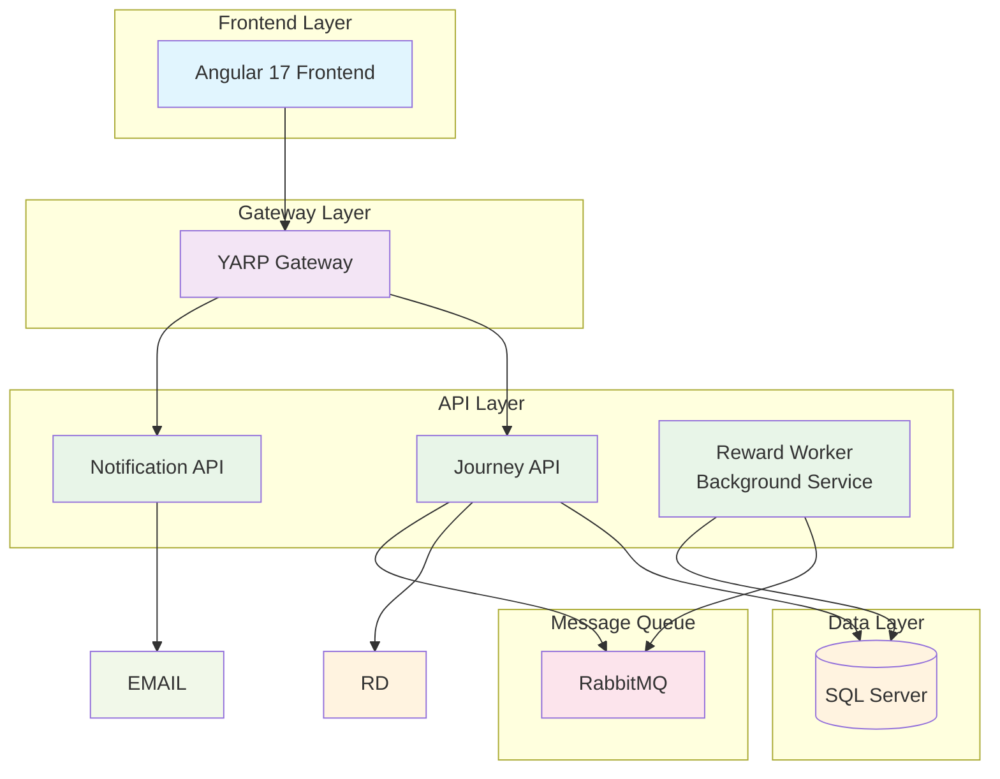
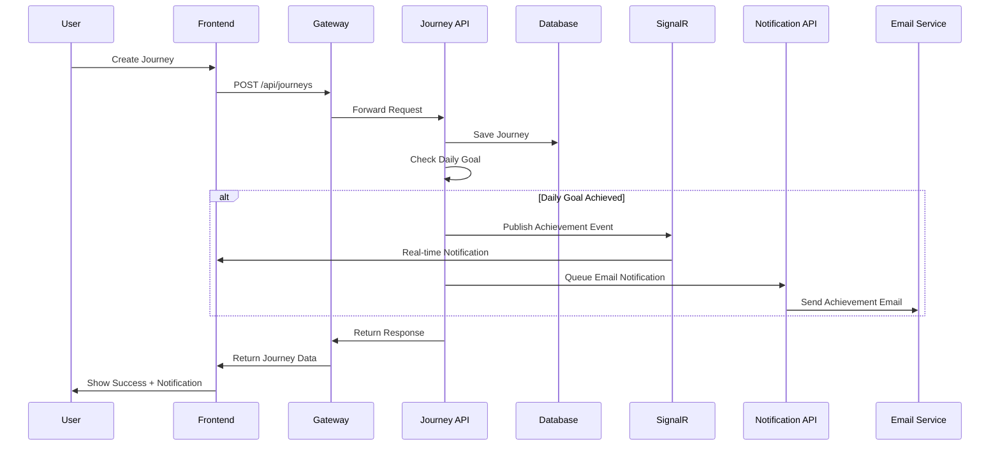

# Navigation Platform

A comprehensive journey tracking and daily goal achievement platform built with .NET 8 and Angular 17, featuring real-time notifications, public journey sharing, and gamified daily goals.

##  Quick Start

### One-Command Startup

```bash
docker compose up
```

This single command will:
- Start all backend services (Journey API, Gateway, Notification API, Reward Worker)
- Start the frontend Angular application
- Set up Sql Server database
- Configure SignalR
- Set up RabbitMQ for message queuing
- Expose all services on their respective ports

**Access Points:**
- Frontend: http://localhost:4200
- Gateway: http://localhost:7001


##  Architecture

### System Overview



### Message Flow Architecture



##  Technology Stack

### Backend
- **.NET 8** - Modern, high-performance framework
- **Entity Framework Core** - ORM with Sql Server provider
- **MediatR** - CQRS pattern implementation
- **SignalR** - Real-time communication
- **YARP** - Reverse proxy gateway
- **RabbitMQ** - Message queuing
- **AutoMapper** - Object mapping
- **FluentValidation** - Input validation

### Frontend
- **Angular 17** - Modern SPA framework
- **RxJS** - Reactive programming
- **SignalR Client** - Real-time updates
- **Angular Material** - UI components
- **TypeScript** - Type-safe JavaScript

### Infrastructure
- **Docker & Docker Compose** - Containerization
- **SQL Server** - Primary database
- **RabbitMQ** - Message broker
- **GitHub Actions** - CI/CD pipeline

##  Features

### Core Functionality
- ✅ **Journey Management** - Create, read, update, delete journeys
- ✅ **Real-time Updates** - Live notifications via SignalR
- ✅ **Public Sharing** - Generate shareable public links
- ✅ **Daily Goals** - 20km daily target with achievement tracking
- ✅ **User Authentication** - JWT-based auth with refresh tokens


##  Design Decisions & Trade-offs

### Architecture Decisions

#### 1. Microservices vs Monolith
**Decision**: Hybrid approach with separate services for different concerns
**Rationale**: 
- Journey API handles core business logic
- Notification API handles external communications
- Gateway provides unified entry point
- Allows independent scaling and deployment

#### 2. CQRS with MediatR
**Decision**: Command Query Responsibility Segregation
**Benefits**:
- Clear separation of read/write operations
- Easy to add cross-cutting concerns (logging, validation)
- Testable and maintainable code
**Trade-off**: Increased complexity for simple CRUD operations

#### 3. SignalR for Real-time Communication
**Decision**: WebSocket-based real-time updates
**Benefits**:
- Instant notifications for journey updates
- Real-time daily goal achievements
- Better user experience
**Trade-off**: Additional infrastructure complexity

#### 4. YARP Gateway
**Decision**: Reverse proxy for API routing
**Benefits**:
- Single entry point for all services
- Load balancing and routing
- Centralized authentication
**Trade-off**: Additional network hop

### Technology Trade-offs

#### Frontend Framework: Angular
**Pros**: Enterprise-grade, TypeScript, comprehensive ecosystem
**Cons**: Steeper learning curve, larger bundle size
**Decision**: Long-term maintainability over initial simplicity

#### Message Queue: RabbitMQ
**Pros**: Reliable, feature-rich, excellent .NET support
**Cons**: Additional infrastructure complexity
**Decision**: Reliable message delivery for critical notifications


##  Development Setup

### Prerequisites
- Docker & Docker Compose
- .NET 8 SDK
- Node.js 18+
- Git


### Local Development
```bash
# Clone repository
git clone <repository-url>
cd NavigationPlatform

### Run these commands to install HTTPS dev certificates:
```bash
dotnet dev-certs https --clean
dotnet dev-certs https -ep "$env:USERPROFILE\.aspnet\https\devcert.pfx" -p pass123!
dotnet dev-certs https --trust

# Start all services
docker compose up -d

# Run backend tests
dotnet test

# Run frontend tests
cd src/FE-NAV
npm test

# Run integration tests
docker compose -f docker-compose.test.yml up --abort-on-container-exit
```

 Test Users

You can log in to the WebApp with these accounts:

Username: dlalaj@ikons-see.com
Password: dorian12345!

Username: lalajdori@gmail.com
Password: d)r!an12345!

##  License

This project is licensed under the MIT License - see the [LICENSE](LICENSE) file for details.

## 🆘 Support

### Getting Help
- **Documentation**: Check this README and inline code docs


